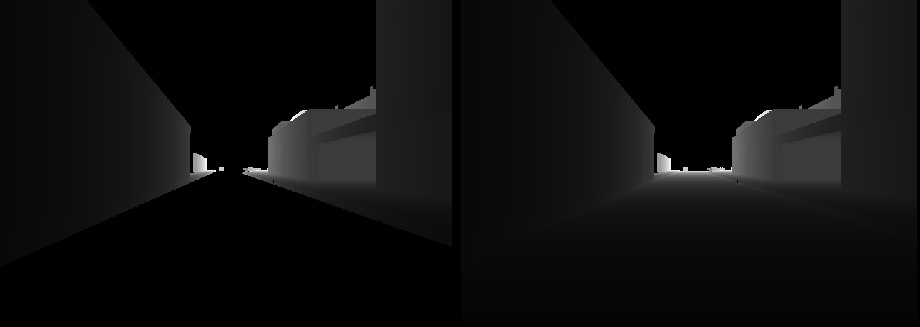

# Simulation Package

## Package Overview
The simulation package contains two major parts, the Unity simulator and the ROS-Unity bridge.

### Unity Simulator
The Unity simulator is located in `simulation\unity_sim\Build_Ubuntu`. To launch the Unity simulator, simply run the binary `AD_Sim.x86_64`.

### ROS-Unity Bridge
The ROS-Unity bridge consists of three components, the parameter reader, the TCP stream receiver, the command transmitter.

#### Parameter Reader
The parameter reader loads the simulation configuration file and publishes the necessary parameters to the ROS parameter server. To check whether parameters are correctly loaded upon launching, simply run `rosparam list` and use `rosparam get` command to inquire the parameters.

#### TCP Stream Receiver
The stream receiver establishes TCP connection with Unity, receiving necessary messages from the simulator. Note that the receiver process **will immediately kill itself if the connection is lost**, i.e. if the simulator process no longer exists. The reason for the design is that data latency between ROS and Unity should only be measured once after launching the simulation. Thus, killing the simulator process indicates a necessary shutdown of the receiver.

#### Command Transmitter

Sends UDP sockets containing driving commands, enabling remote control of the vehicle. The node will send the commands in 100Hz regardless of the existance of the Unity instance.

## Getting Started

To launch all necessary nodes, simply run

```bash
roslaunch simulation simulation.launch
```
Note: If you find Unity-sim process dies immediately, please refer to section *Known issue: Unity-sim process dies when launching*.

## Customize the Simulation
The Unity simulator and the ROS package reads a configuration JSON file at `simulation\unity_sim\Build_Ubuntu\AD_Sim_Data\StreamingAssets\simulation_config.json` upon launching, in which you could customize the simulation.

### `spawnIndexData/spawnIndex`

Indicates the spawn position index of the ego vehicle. Ranges from 0 to 9.

### `eventEnable`

Setting the boolean value to `false` deactivate the corresponding event trigger. For description of the events please refer to the project PDF file.

### `controlConfig`

#### `address` and `port`

Define the address and port of the machine running the Unity simulation. If you are running Unity simulation and ROS on the same machine, leave the address to `127.0.0.1`.

#### `controllerOnly`

Setting the field to `true` will make the vehicle controllable **ONLY** by the keyboard input.

#### `controllerOverride`

Setting the field to `true` will make keyboard input override the command sent by ROS node, as keys are pressed down. Of course, with `controllerOnly` set to `true`, this field is ingored by the Unity simulator.

### `sensorConfig`

#### `address` and `port`

Define the address and port of the machine running the ROS node. If you are running Unity simulation and ROS on the same machine, leave the address to `127.0.0.1`.

#### `groundRemoval`

Setting this to `true` will turn roads into null in depth camera, as shown in the figure.



#### `truePose`

Setting the field to `false` will prevent the pose of the ego vehicle being trasmitted to the ROS topic.

## Known Issue: Unity-sim process dies when launching

Try starting the simulation process individually, not in the ROS launch file.

Run:

```bash
./src/simulation/unity_sim/Build_Ubuntu/AD_Sim.x86_64
```

While in another console, run:

```bash
source devel/setup.bash
roslaunch simulation simulation_no_Unity.launch
```

The cause to this issue is still unclear :(.

## Alternative: Run the ROS and Unity Simulator on Different Machines

As TCP/UDP transmissions are not limited to local machines, you could certainly try running the Unity simulator on another machine, e.g. run the Unity simulator in Windows while running ROS on a WSL instacne. If you are doing so, please make sure that contents of `simulation_config.json` on both machines are the same. Otherwise, Unity-ROS bridge is not likely to work correctly.

For the Unity simulator, a Windows build is available, please refer to the project description PDF file on Moodle.
